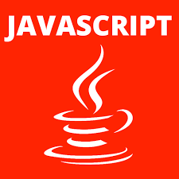

### <h1>
Hi 👋 I'm Hosam Saleh
</h1>

<h2>Full Stack Engineer, from Al Fayoum, Egypt.</h2>
* Crafting software
* Hunting bugs

- 🔭 I’m currently Using Python for Development and Scripting ...
- 🌱 I’m currently Summons Web Scraping for data Science ...
- 👯 All of my projects are available at <a href="https://github.com/HosamSaleh1?tab=repositories" alt="My Repos">My Repository</a> ...
ship Shipping softwares in Docker on Prem and on the Cloud ..
- 🤔 I’m Learning competitive programming / problem solving / Encryption ...
- 💬 Ask me about Building the web: I use Flask ...

I love to work with apple, and play with Linux penguin, thinking I'am interested in Web Development, Building devtools, Automation, DevOps, and Cloud Technologies.

<a herf="Connect With Me:"><h3>Languages and Tools:</h3></a>

Python, Flask, Git, PostgreSQL, SQLite, HTML, CSS, Javascript, WordPress, Docker, Heroku and Auth0.

- 📫 How to reach me: ...
<h3>Connect with me:</h3>
Please email via <a href="mailto:mr.hosamsaleh@yahoo.com" alt="Hosam Saleh @ Yahoo.Com">mr.hosamsaleh@yahoo.com.</a> 

- ⚡ Fun fact: Coding is what makes life tasty ...
